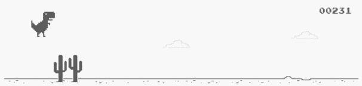

# Dino Machine Learning

 

A simple artificial intelligence to teach Google Chrome's offline dinosaur to jump obstacles, using Neural Networks and a simple Genetic Algorithm. The algorithm are written from scratch without any python ML libraries.

Inspired by [https://github.com/ivanseidel/IAMDinosaur](https://github.com/ivanseidel/IAMDinosaur) 

## Run & Learn

* Install dependencies: `pip install -r requirements.txt`
* Open Chrome's dinosaur game and put aside the terminal (It MUST be on the same screen) (Tip: go to developer tools, and under network, set to offline)
* Run the AI: `python ai.py`
* After 5/8 generations, the dino should be a ninja!

## TODO

- [ ] Find game automatically in the screen at the beginning
- [ ] Make it crossplatform (so far the pressed keyboard keys are for MacOS)
- [ ] Handle key down (some obstacles can't be jumped)
- [ ] Handle day *and* night
- [ ] Take obstacle height into account
